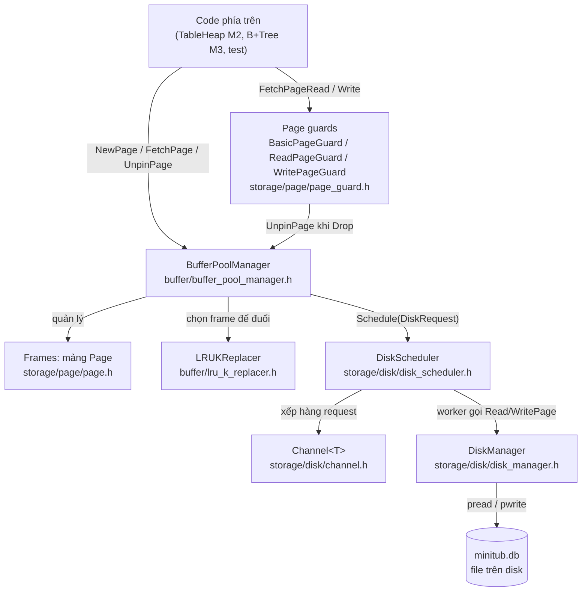
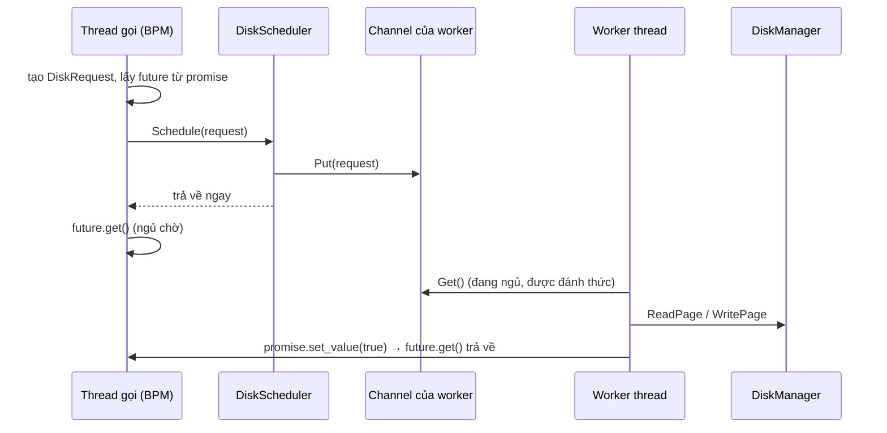
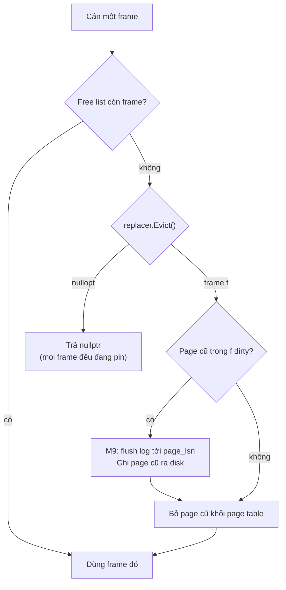
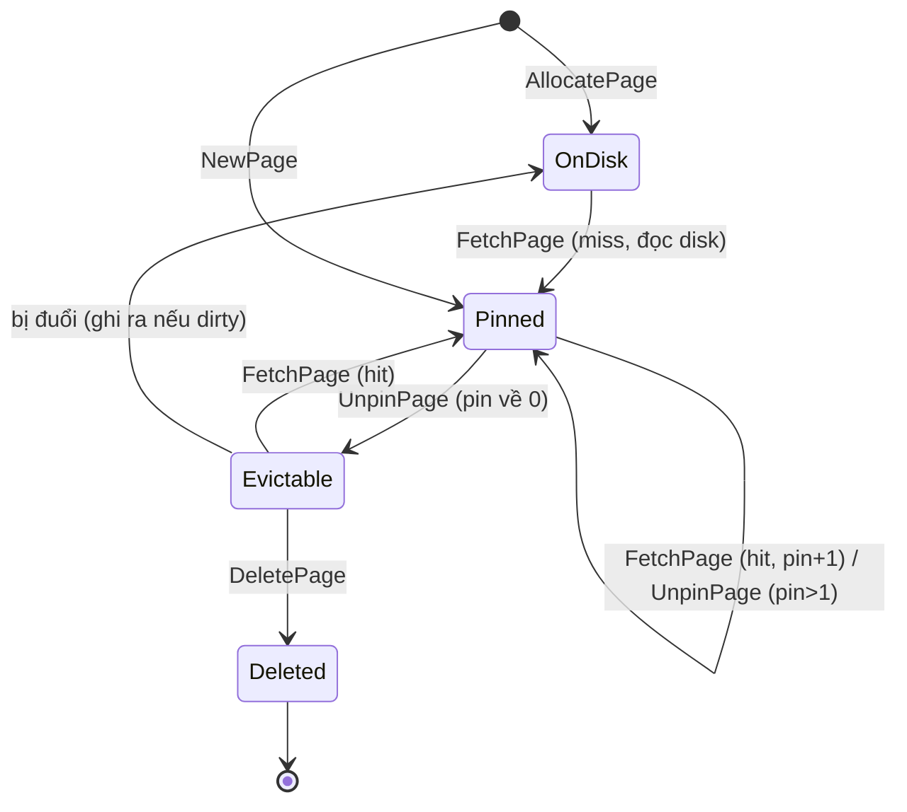

# Kiến trúc M1: Storage core

Tài liệu giải thích **từng file, từng hàm** của M1 và cách chúng phối hợp với nhau.
Đây là tài liệu đọc hiểu; spec chính thức (các rule mà test kiểm tra) nằm ở
[design.md §7](design.md#7-storage-core-interfaces-m1).

> Tài liệu chỉ mô tả *cái gì* và *tại sao*, không có code implement. Phần *làm thế nào* là của bạn.

---

## 1. File `.h` và `.cpp` là gì?

| | `.h` (header) | `.cpp` (source) |
|---|---|---|
| Chứa gì | **Khai báo**: tên class, hàm, kiểu tham số, kiểu trả về, comment về hành vi | **Định nghĩa**: thân hàm, tức code thực sự chạy |
| Vai trò | **Hợp đồng (interface)**: "tôi cung cấp những hàm này, hành xử như này" | **Cách thực hiện** hợp đồng đó |
| Ai dùng | File khác `#include` nó để biết có những gì mà gọi | Compiler dịch thành `.o`, linker ghép vào thư viện/binary |
| Trong M1 | Tôi viết sẵn, **bạn không cần sửa** (trừ phần `private:` có `TODO(M1)`) | Hiện là stub `throw NotImplemented`, **bạn viết thân hàm** |

Vì sao tách đôi:
- **Biên dịch nhanh:** sửa `.cpp` thì chỉ file đó dịch lại; sửa `.h` thì mọi file include nó đều dịch lại.
- **Tách interface khỏi implementation:** test chỉ phụ thuộc vào `.h`, nên bạn đổi cách làm bên trong thoải mái mà test không cần đổi.
- **Ẩn chi tiết:** code dùng `BufferPoolManager` không cần biết bên trong nó có hash map hay list.

Ngoại lệ: **`channel.h` không có `.cpp`**. `Channel<T>` là *template*, mà compiler phải thấy thân hàm template ở chỗ dùng, nên toàn bộ code template nằm trong header.

Phần `private:` trong header là nơi bạn **tự khai báo biến thành viên** (mutex, hash map, vector frame, ...). Đó là quyết định thiết kế của bạn, nên tôi để trống với `// TODO(M1)`.

---

## 2. Bức tranh tổng thể



Mỗi tầng chỉ nói chuyện với tầng ngay dưới nó:
- **DiskManager:** biết file và offset, không biết cache là gì.
- **DiskScheduler:** chạy I/O ở background, không biết page nào quan trọng.
- **Replacer:** chỉ biết frame id và thời điểm truy cập, không biết dữ liệu.
- **BufferPoolManager:** bộ não; biết page nào đang nằm ở frame nào, pin bao nhiêu, bẩn hay sạch.
- **Page guard:** tiện ích RAII để người dùng không quên unpin hoặc unlatch.

---

## 3. Từ vựng cần nắm

| Thuật ngữ | Nghĩa |
|---|---|
| **Page** | Một khối 4096 byte (`PAGE_SIZE`) của file DB, đánh số bằng `page_id_t` (0, 1, 2, ...) |
| **Frame** | Một ô trong RAM của buffer pool, đánh số bằng `frame_id_t`. Một frame chứa một page tại một thời điểm |
| **Resident** | Page đang nằm trong một frame nào đó |
| **Page table** | Bảng `page_id → frame_id`, cho biết page nào đang ở frame nào |
| **Free list** | Danh sách frame chưa chứa page nào |
| **Pin / pin count** | Số người đang dùng page. Pin > 0 thì **không được đuổi** frame đó |
| **Unpin** | Báo "tôi dùng xong", pin giảm 1 |
| **Dirty** | Page trong RAM đã bị sửa, khác bản trên disk. Trước khi đuổi phải ghi ra |
| **Evict (đuổi)** | Lấy lại một frame đang chứa page (pin = 0) để chứa page khác |
| **Evictable** | Frame được phép đuổi (pin = 0). Replacer chỉ chọn trong số này |
| **Latch** | Khóa ngắn hạn trong RAM (mutex) bảo vệ cấu trúc dữ liệu. Khác "lock" của transaction (M8) |
| **Hit / Miss** | Fetch thấy page đã ở trong RAM (hit) hoặc phải đọc từ disk (miss) |
| **LSN** | Log Sequence Number, dùng cho WAL ở M9 |

---

## 4. Từng file, từng hàm

### 4.1 `src/storage/disk/disk_manager.h` và `.cpp`: đọc/ghi page trên file

**Vai trò:** tầng thấp nhất. Đổi `page_id` thành vị trí trong file (`page_id * PAGE_SIZE`) rồi đọc/ghi đúng 4096 byte ở đó.

| Hàm | Làm gì | Quy tắc quan trọng |
|---|---|---|
| `DiskManager(path, mode)` | Mở file (tạo nếu chưa có) | File đã có thì giữ nguyên page cũ. `IoMode::Direct` mở với `O_DIRECT` (bỏ qua page cache của OS). Lỗi mở file thì ném `Exception(Io)` |
| `~DiskManager()` | Đóng file | Destructor không được throw |
| `ReadPage(id, out)` | Copy page `id` từ file vào buffer `out` (4096 byte) | `id < 0` hoặc `id >= NumPages()` thì ném `OutOfRange`. Page đã cấp nhưng chưa ghi thì đọc ra toàn số 0 |
| `WritePage(id, data)` | Ghi 4096 byte vào page `id` | Cùng rule `OutOfRange`: phải `AllocatePage` trước |
| `AllocatePage()` | Cấp page mới: trả về `NumPages()` và làm file dài thêm một page toàn số 0 | Id tăng dần 0, 1, 2, ...; mở lại file vẫn tiếp tục đúng số |
| `DeallocatePage(id)` | Đánh dấu page đã bỏ | M1: chỉ ghi nhận, không tái sử dụng id |
| `NumPages()` | Số page đã cấp | Bằng kích thước file / `PAGE_SIZE` |
| `GetStats()` | Trả về `{reads, writes}` | Đã viết sẵn; **bạn tăng** `num_reads_`/`num_writes_` trong Read/WritePage |

`std::span<std::byte, PAGE_SIZE>` là "một con trỏ kèm độ dài đúng 4096". Nó giúp compiler chặn truyền nhầm buffer sai kích thước.

**Thread-safety:** nhiều worker của scheduler có thể gọi cùng lúc, nên số page và việc tăng kích thước file phải được bảo vệ.

**Test:** `test/storage/disk_manager_test.cpp` (10 test).

---

### 4.2 `src/storage/disk/channel.h`: hàng đợi giữa các thread

**Vai trò:** một hàng đợi FIFO an toàn khi nhiều thread cùng dùng. Scheduler dùng nó để chuyển request từ thread gọi sang thread worker.

| Hàm | Làm gì | Quy tắc |
|---|---|---|
| `Put(value)` | Thêm vào cuối hàng | Không bao giờ chặn (hàng không giới hạn) |
| `Get()` | Lấy phần tử đầu hàng | **Chặn (ngủ) cho tới khi có phần tử.** Không được busy-loop (quay vòng tốn CPU) |

Khái niệm cần tìm hiểu: `std::mutex`, `std::condition_variable` (ngủ và đánh thức), và *spurious wakeup* (bị đánh thức mà chưa có gì trong hàng).

**Test:** 3 test `ChannelTest.*` trong `disk_scheduler_test.cpp`.

---

### 4.3 `src/storage/disk/disk_scheduler.h` và `.cpp`: chạy I/O ở background

**Vai trò:** nhận request đọc/ghi và trả về ngay; worker thread làm I/O thật rồi báo kết quả qua `std::promise`.

**`DiskRequest`** (struct) có bốn trường:
- `is_write`: đọc hay ghi.
- `data`: con trỏ tới buffer 4096 byte. Buffer phải sống cho tới khi request xong.
- `page_id`: page cần đọc/ghi.
- `callback` (`std::promise<bool>`): worker gọi `set_value(true)` khi xong, `set_value(false)` nếu DiskManager ném lỗi. Người gọi giữ `std::future<bool>` tương ứng và `.get()` để chờ.

| Hàm | Làm gì | Quy tắc |
|---|---|---|
| `DiskScheduler(dm, num_workers)` | Tạo `num_workers` thread worker | Mỗi worker có một channel riêng |
| `Schedule(request)` | Đẩy request vào channel của worker `page_id % num_workers` | Trả về ngay, không chờ I/O. Nhờ cách chia này, mọi request của **cùng một page** đi vào **cùng một worker**, nên giữ đúng thứ tự |
| `~DiskScheduler()` | Tắt sạch | Làm xong mọi request đã nhận, rồi gửi `std::nullopt` (tín hiệu dừng) cho từng worker, rồi `join()` |

Luồng một request:


**Test:** 12 test `DiskSchedulerTest.*`, mỗi test chạy hai lần với 1 và 4 worker.

---

### 4.4 `src/storage/page/page.h`: một frame trong RAM

**Vai trò:** ô chứa dữ liệu của một page cùng thông tin quản lý. BPM tạo sẵn `pool_size` đối tượng `Page` và tái sử dụng chúng mãi.

| Thành phần | Ý nghĩa |
|---|---|
| `data_` | 4096 byte dữ liệu, `alignas(PAGE_SIZE)` để dùng được với `O_DIRECT` |
| `page_id_` | Page nào đang ở frame này (`INVALID_PAGE_ID` nếu trống) |
| `pin_count_` | Số người đang dùng |
| `is_dirty_` | Đã bị sửa so với disk chưa |
| `page_lsn_` | Dành cho WAL ở M9, hiện chưa dùng |
| `latch_` (`std::shared_mutex`) | Khóa bảo vệ **nội dung** page: nhiều người đọc cùng lúc, hoặc đúng một người ghi |

| Hàm | Làm gì |
|---|---|
| `GetData()` | Con trỏ tới 4096 byte dữ liệu |
| `GetPageId()`, `GetPinCount()`, `IsDirty()`, `GetLsn()`/`SetLsn()` | Đọc thông tin (getter thuần) |
| `RLatch()`/`RUnlatch()` | Lấy/nhả khóa đọc (shared) |
| `WLatch()`/`WUnlatch()` | Lấy/nhả khóa ghi (exclusive) |

`friend class BufferPoolManager` nghĩa là chỉ BPM được sửa trực tiếp `page_id_`, `pin_count_`, `is_dirty_`. Người dùng bên ngoài chỉ đọc được.

Hai loại latch **khác nhau**, đừng nhầm:
- **Latch của BPM:** bảo vệ *sổ sách* (page table, free list, pin count, dirty flag).
- **Latch của page:** bảo vệ *nội dung* 4096 byte.

---

### 4.5 `src/buffer/replacer.h`: interface chung của thuật toán đuổi

Lớp trừu tượng (toàn hàm `virtual ... = 0`). M1 có một cài đặt là LRU-K. Sau này thêm LRU và Clock cho experiment E1, BPM không cần đổi code nhờ interface này.

---

### 4.6 `src/buffer/lru_k_replacer.h` và `.cpp`: thuật toán LRU-K

**Vai trò:** khi BPM cần một frame, chọn frame nào để đuổi. Replacer chỉ làm việc với **frame id**.

**Ý tưởng LRU-K:**
- Mỗi lần truy cập, frame được gắn một "dấu thời gian" logic tăng dần. Chỉ nhớ **k lần gần nhất**.
- *Backward k-distance* = bây giờ − thời điểm của lần truy cập **thứ k tính từ gần nhất**.
- Frame chưa đủ k lần truy cập có k-distance = **+∞**, nên bị đuổi trước.
- Đuổi frame có k-distance **lớn nhất**, tức frame "lâu rồi không được dùng thường xuyên".
- Hòa nhau ở +∞ thì đuổi frame có **lần truy cập cũ nhất sớm nhất**. Đây là chỗ khác với LRU thường, và là bẫy hay gặp.
- Vì sao cần LRU-K: LRU thường bị một lần quét tuần tự lớn đẩy hết page "nóng" ra ngoài. LRU-K ưu tiên giữ page được dùng *lặp lại*.

| Hàm | Làm gì | Quy tắc |
|---|---|---|
| `LRUKReplacer(num_frames, k)` | Tạo replacer cho frame `0..num_frames-1` | |
| `RecordAccess(f)` | Ghi nhận frame `f` vừa được truy cập | Frame mới xuất hiện lần đầu **chưa evictable**. `f` ngoài phạm vi thì ném `OutOfRange` |
| `SetEvictable(f, bool)` | Bật/tắt quyền đuổi | Frame chưa theo dõi thì bỏ qua; set lặp cùng giá trị không đếm hai lần |
| `Evict()` | Chọn nạn nhân, **xóa lịch sử** của nó, trả về frame id | Không có ai evictable thì trả `std::nullopt` |
| `Remove(f)` | Quên hẳn một frame (khi page bị xóa) | Frame chưa theo dõi thì bỏ qua; frame không evictable thì ném `Invalid` |
| `Size()` | Số frame **đang evictable** | |

Ví dụ với k = 2 (t = dấu thời gian):
```
t0: frame 1   t1: frame 2   t2: frame 3   t3: frame 3   t4: frame 2   t5: frame 1
lần thứ 2 gần nhất: frame1 → t0, frame2 → t1, frame3 → t2
→ đuổi theo thứ tự 1, 2, 3   (LRU thường sẽ đuổi 3 trước vì 3 ít được dùng gần đây nhất)
```

**Thread-safety:** tự có mutex riêng. **Test:** 16 test `LRUKReplacerTest.*`.

---

### 4.7 `src/buffer/buffer_pool_manager.h` và `.cpp`: bộ não

**Vai trò:** cache page của disk trong `pool_size` frame. Mọi tầng trên (TableHeap, B+Tree) đọc/ghi page **chỉ thông qua BPM**.

**Thành phần bên trong** (bạn tự khai báo trong `private:`): mảng `Page` (các frame), page table, free list, một `LRUKReplacer`, một `DiskScheduler`, một mutex của BPM.

**Cách lấy một frame** (dùng chung cho `NewPage` và `FetchPage`):


| Hàm | Làm gì | Quy tắc |
|---|---|---|
| `BufferPoolManager(pool_size, dm, k, workers)` | Tạo frame, free list (ban đầu chứa mọi frame), replacer, scheduler | |
| `NewPage()` | Tạo page mới trong một frame | Lấy frame **trước**, cấp page id **sau** (lấy frame thất bại thì không phí id). Page được zero, pin = 1, sạch |
| `FetchPage(id)` | Đưa page `id` vào RAM (nếu chưa có) và pin nó | Đã resident: pin + 1, là **hit**. Chưa: lấy frame, đọc từ disk, pin = 1, là **miss**. Mọi lần thành công: `RecordAccess` và `SetEvictable(false)` |
| `UnpinPage(id, is_dirty)` | Bớt một pin | `false` nếu không resident hoặc pin đã là 0. Cờ dirty **dính**: truyền `false` không xóa được dirty cũ. Pin về 0 thì `SetEvictable(true)` |
| `FlushPage(id)` | Ghi page ra disk ngay, xóa cờ dirty | `false` nếu không resident. Ghi cả khi page sạch |
| `FlushAllPages()` | Flush mọi page resident | |
| `DeletePage(id)` | Xóa page khỏi pool | Đang pin thì `false`. Không resident thì `true`. Còn lại: trả frame về free list (không ghi ra disk), `Remove` khỏi replacer, `DeallocatePage` |
| `NewPageGuarded()`, `FetchPageBasic/Read/Write(id)` | Như trên nhưng trả về **guard** | Read/Write guard: BPM pin xong thì lấy `RLatch`/`WLatch` rồi mới trao guard. Thất bại thì trả guard rỗng |
| `FreeFrameCount()` | Số frame trong free list | Dùng trong test phát hiện rò frame |
| `GetStats()` | `{hits, misses, evictions}` | Đã viết sẵn; bạn tăng counter ở đúng chỗ |

Vòng đời của một page:


**Test:** 15 test `BufferPoolManagerTest.*` và 1 stress test 8 thread (`buffer_pool_stress_test.cpp`).

---

### 4.8 `src/storage/page/page_guard.h` và `.cpp`: RAII cho page

**Vấn đề cần giải quyết:** gọi `FetchPage` mà quên `UnpinPage` thì frame bị giữ mãi (rò). Quên `RUnlatch` thì các thread khác kẹt mãi (deadlock).

**Giải pháp RAII:** đối tượng guard nắm pin (và latch). Khi guard ra khỏi scope, destructor tự nhả. Cùng ý tưởng với `std::lock_guard` và `std::unique_ptr`.

| Guard | Giữ gì | Khi `Drop()` / hủy |
|---|---|---|
| `BasicPageGuard` | Pin | Unpin (dirty nếu đã gọi `GetDataMut()`) |
| `ReadPageGuard` | Pin + khóa đọc | **Nhả latch trước**, rồi unpin |
| `WritePageGuard` | Pin + khóa ghi | **Nhả latch trước**, rồi unpin (dirty nếu đã gọi `GetDataMut()`) |

| Hàm | Làm gì |
|---|---|
| Constructor `(bpm, page)` | Nhận quyền sở hữu một pin (và latch) mà BPM đã lấy sẵn |
| Move constructor | Chuyển quyền sang guard mới; guard cũ thành **rỗng** |
| Move assignment | **Nhả page đang giữ trước**, rồi nhận page mới; guard nguồn thành rỗng |
| `~Guard()` | Gọi `Drop()` |
| `Drop()` | Nhả sớm; gọi hai lần không sao (idempotent) |
| `IsValid()` | Có đang giữ page không (guard rỗng hoặc fetch thất bại thì `false`) |
| `PageId()`, `GetData()` | Đọc id và dữ liệu |
| `GetDataMut()` | Lấy dữ liệu để sửa, **đánh dấu dirty** (chỉ có ở Basic và Write) |

Vì sao **cấm copy** (`DISALLOW_COPY`): copy một guard thì hai đối tượng cùng tưởng mình giữ pin, dẫn tới unpin hai lần.

Vì sao **nhả latch trước khi unpin**: unpin xong là frame có thể bị đuổi và gán cho page khác ngay. Nếu lúc đó mình còn giữ latch, người khác sẽ nhận một frame đang bị khóa bởi người không còn liên quan.

**Test:** 11 test `PageGuardTest.*`.

---

## 5. Mô hình đồng thời (concurrency)

| Latch | Thuộc về | Bảo vệ |
|---|---|---|
| Mutex của BPM | `BufferPoolManager` | Page table, free list, pin count, dirty flag |
| Mutex của replacer | `LRUKReplacer` | Lịch sử truy cập, cờ evictable |
| Mutex + condition variable | `Channel` | Hàng đợi |
| `shared_mutex` của page | Mỗi `Page` | 4096 byte nội dung |
| Mutex của DiskManager | `DiskManager` | Số page, việc tăng kích thước file |

Nguyên tắc tránh deadlock:
1. **Không chờ latch của page khi đang giữ latch của BPM.** Pin page trong latch BPM, **nhả latch BPM**, rồi mới `RLatch`/`WLatch` page.
2. Luôn lấy latch theo **cùng một thứ tự** ở mọi nơi.
3. Cố gắng không giữ latch BPM trong lúc chờ disk. Nếu phải giữ (cách đơn giản cho bản đầu), hãy biết rằng mọi thread sẽ phải xếp hàng. Đó là một trade-off đáng ghi vào nhật ký.

---

## 6. Test và file tương ứng

| File test | Kiểm tra | Số test |
|---|---|---|
| `test/storage/disk_manager_test.cpp` | DiskManager | 10 |
| `test/storage/disk_scheduler_test.cpp` | Channel + DiskScheduler | 15 |
| `test/buffer/lru_k_replacer_test.cpp` | LRUKReplacer | 16 |
| `test/buffer/buffer_pool_manager_test.cpp` | BufferPoolManager | 15 |
| `test/storage/page_guard_test.cpp` | Page guards (qua BPM) | 11 |
| `test/buffer/buffer_pool_stress_test.cpp` | Toàn bộ, 8 thread, TSan | 1 |
| `test/test_util.h` | Tiện ích chung: file tạm, buffer align, stamp | |

Mỗi test có comment `// checks:` nói rõ tính chất nó kiểm tra. Chạy từng nhóm:
`ctest --preset debug -R LRUKReplacerTest`. Thứ tự nên làm: Channel → DiskManager → DiskScheduler → LRU-K → BPM → Guards → Stress.

---

## 7. File hỗ trợ khác

| File | Vai trò |
|---|---|
| `src/common/config.h` | `PAGE_SIZE`, kiểu `page_id_t`/`frame_id_t`/`lsn_t`, `INVALID_PAGE_ID` |
| `src/common/macros.h` | `MT_ASSERT`, `DISALLOW_COPY`, `DISALLOW_COPY_AND_MOVE` |
| `src/common/exception.h` | `Exception` với `ExceptionType` (`Invalid`, `OutOfRange`, `NotImplemented`, `Config`, `Io`) |
| `src/common/engine_config.h` | `IoMode`, `ReplacerType`, `pool_size`, ... (bench dùng cho E1/E2) |
| `src/CMakeLists.txt` | Gom cả M1 thành một thư viện `minitub_storage` (guard và BPM phụ thuộc lẫn nhau nên để chung) |
