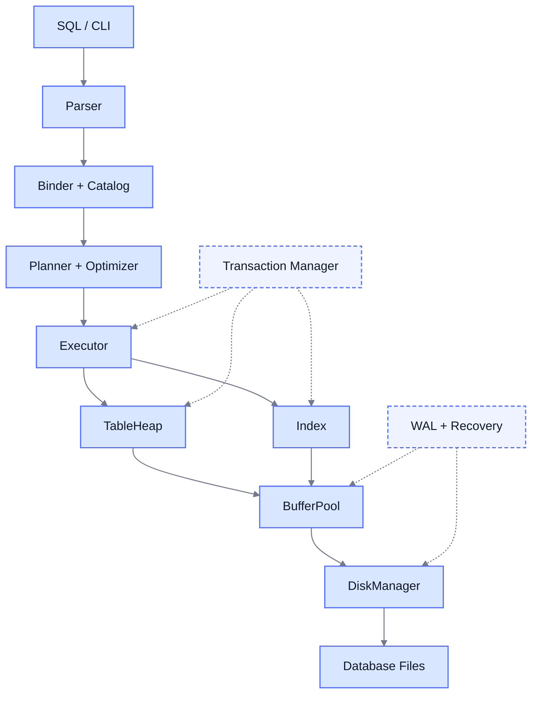
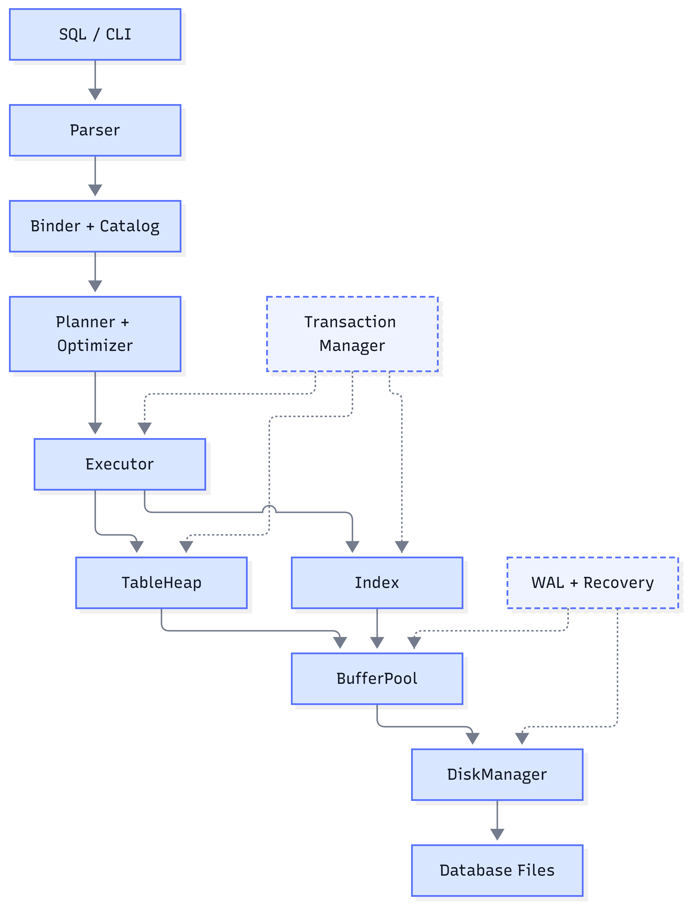

flowchart TD
  CLI[SQL / CLI Shell] --> P[Parser Lexer + AST]
  P --> B[Binder resolve names & types]
  B --> PL[Planner AST to plan tree]
  PL --> O[Optimizer rule-based rewrites]
  O --> E[Execution Engine Volcano Init / Next]

  E --> TH[TableHeap slotted pages, tuples, RID]
  E --> IX[Index B+ Tree / Extendible Hash]
  TH --> BP[Buffer Pool Manager LRU-K replacer, page guards]
  IX --> BP
  BP --> DS[Disk Scheduler I/O queue + worker thread]
  DS --> DM[Disk Manager read / write 4KB pages]
  DM --> DB[(minitub.db)]

  CAT[Catalog tables, indexes, schemas]
  B -.-> CAT
  O -.-> CAT
  E -.-> CAT

  TM[Transaction Manager MVCC, undo logs, watermark GC]
  E -.-> TM
  TM -.-> TH

  WAL[Log Manager WAL, group commit]:::future
  REC[Recovery Manager ARIES: analysis, redo, undo]:::future
  BP -.->|flush log before page| WAL
  TM -.->|commit waits for fsync| WAL
  WAL --> LOG[(minitub.log)]
  LOG --> REC

  classDef future stroke-dasharray:5 3

  
